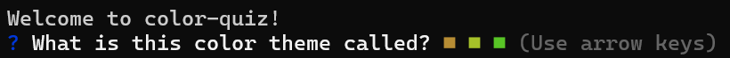
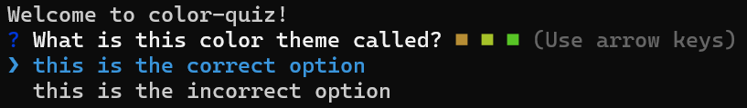
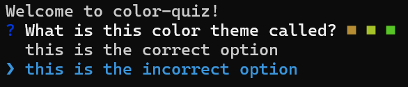
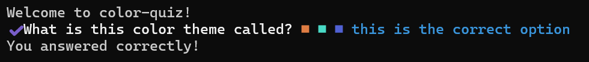
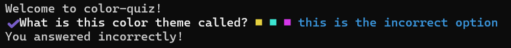
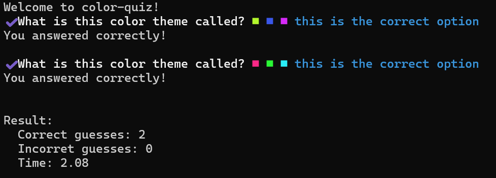

# Test specification

## Test case 1.1, View Question
View that a question appears with a set of colors.

### Input:
1. Navigate to project.
2. In the terminal, enter **npm run start-manual-testing-instance**

### Output:
- A welcome message should be displayed saying "Welcome to color-quiz!"
- A question should be displayed with the text "What is this color theme called?"
- The question should be followed by three differntly colored squares, see figure 1 as an example (the colors of the square might be different from figure 1).

|  |
|----------------------------------------------------------|
| Figure 1 |
---

## Test case 5.1, View Options
View that a set of options appears.

### Input:
1. Test case 1.1

### Output:
- Two options should be displayed below the question.
- The first option should say "this is the correct option", see figure 2.
- The text of the first option should be colored blue.
- The second option should say "this is the incorrect option", see figure 2.

|  |
|----------------------------------------------------------|
| Figure 2 |
---

## Test case 5.2 Navigate Between Options
Navigate between options using the arrow keys.

### Input:
1. Test case 5.1
2. Click the arrow-down key on the keyboard.

### Output:
- The text of the first option should be colored white, see figure 3.
- The text of the second option should be colored blue, see figure 3.

|  |
|----------------------------------------------------------|
| Figure 3 |
---

## Test case 6.1, Pick an Correct Option
Pick the correct option for a question.

### Input:
1. Test case 1.1
2. Click the enter key on the keyboard.

### Output:
- The text 'You answered correctly!' should be displayed, see figure 4.

|  |
|----------------------------------------------------------|
| Figure 4 |
---

## Test case 6.2, Pick an Incorrect Option
Pick the incorrect option for a question.

### Input:
1. Test case 5.2
2. Click the enter key on the keyboard.

### Output:
- The text 'You answered incorrectly!' should be displayed, see figure 5.

|  |
|----------------------------------------------------------|
| Figure 5 |
---

## Test case 7.1, View time
View that the time it took to complete the quiz appears.

### Input:
1. Test case 1.1
2. Click the enter key on the keyboard.
3. Click the enter key on the keyboard.

### Output:
- A message should be displayed that shows the time it took to complete the quiz, see figure 6 as an example (the number after "Time" might be different from figure 6).

|  |
|----------------------------------------------------------|
| Figure 6 |
---
